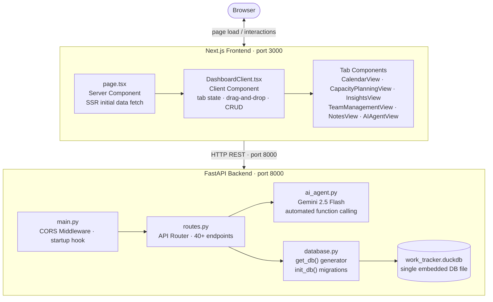
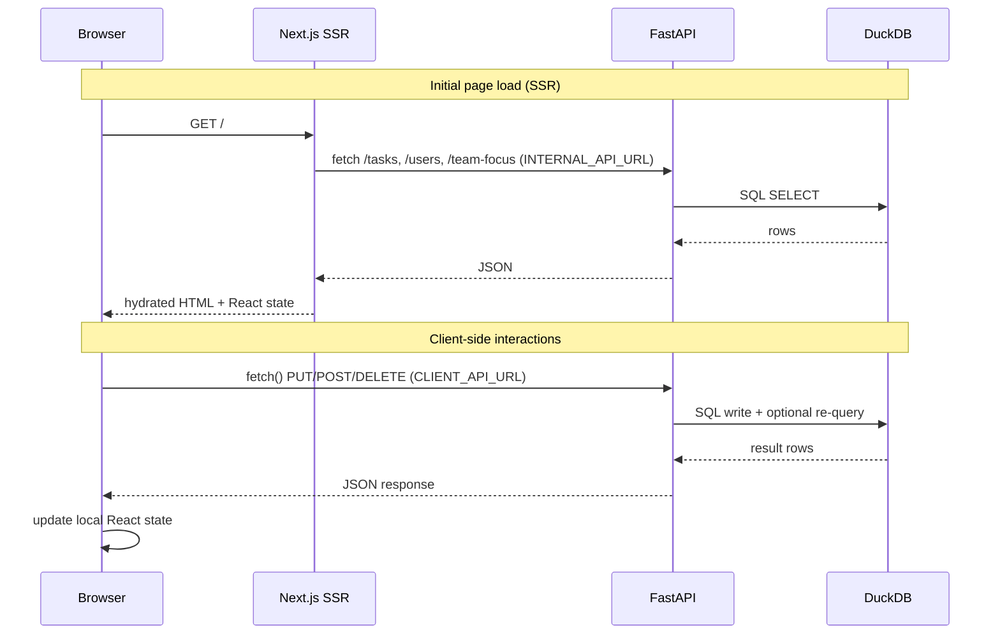
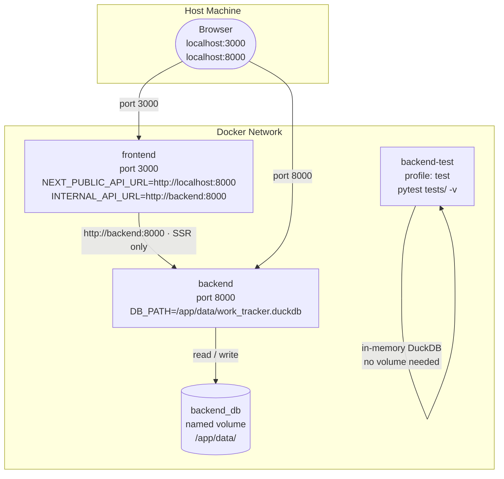
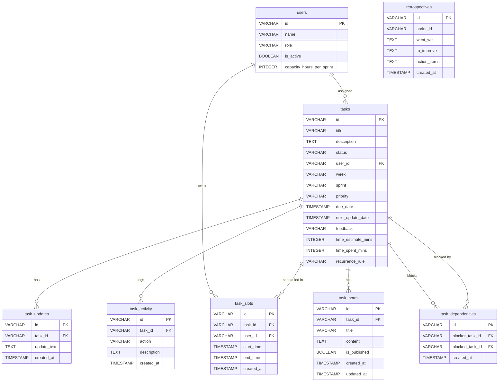

# Work Orbit

A full-stack internal work and task tracking application built for software teams. Work Orbit covers the full lifecycle of work — from idea capture to sprint delivery — with time tracking, capacity planning, calendar scheduling, retrospectives, dependency management, and an AI agent that can act on your behalf.

---

## Table of Contents

1. [Self-Starter Guide](#self-starter-guide)
2. [Features](#features)
3. [Requirements](#requirements)
4. [High Level Design](#high-level-design)
5. [Low Level Design](#low-level-design)

---

## Self-Starter Guide

### Prerequisites

| Tool | Version |
| --- | --- |
| Python | 3.11+ |
| Node.js | 20+ |
| Docker + Docker Compose | 24+ (optional) |

---

### Option A — Local Development (recommended for active work)

#### 1. Clone the repo

```bash
git clone <repo-url>
cd work-orbit
```

#### 2. Backend setup

```bash
cd backend
python3 -m venv venv
source venv/bin/activate          # Windows: venv\Scripts\activate
pip install -r requirements.txt
```

Set up environment variables:

```bash
cp .env.example .env              # or create .env manually
```

`.env` contents:

```env
GOOGLE_API_KEY=your_gemini_api_key_here   # optional — enables AI Agent
```

Start the backend (hot reload):

```bash
uvicorn main:app --host 0.0.0.0 --port 8000 --reload
```

Backend is live at <http://localhost:8000>. Interactive API docs at <http://localhost:8000/docs>.

#### 3. Frontend setup

```bash
cd frontend
npm install
npm run dev
```

Frontend is live at <http://localhost:3000>.

---

### Option B — Docker Compose (Full Stack Out-of-the-Box)

```bash
docker compose up -d --build
```

| Service | URL |
| --- | --- |
| Frontend | <http://localhost:3000> |
| Backend API | <http://localhost:8000> |
| API Docs | <http://localhost:8000/docs> |

**Key Container Features:**

- **Persistent Data**: The database is persisted in a named Docker volume (`backend_db`). Data survives container restarts.
- **Secure Code Execution**: The backend maps the host's `/var/run/docker.sock` to enable Docker-in-Docker (DooD) capabilities. The "Jupyter-style" code-execution feature inside notes will securely spawn scoped, isolated containers (e.g., Python, Node.js) on your host daemon without complex setup.

#### Run tests inside Docker

```bash
docker compose --profile test run --rm backend-test
```

---

### Running Tests Locally

Backend (pytest):

```bash
cd backend
source venv/bin/activate
PYTHONPATH=. pytest tests/ -v
```

Frontend (Jest + React Testing Library):

```bash
cd frontend
npx jest
```

Expected results: **22 backend tests**, **85 frontend tests** — all passing.

---

## Features

### Dashboard — Kanban Board

Four-column kanban view for task lifecycle management:

| Column | Status value | Purpose |
| --- | --- | --- |
| To Be Classified | `to_be_classified` | Inbox for new/unsorted tasks |
| Current Focus | `current` | Active work this sprint |
| Upcoming | `upcoming` | Planned but not started |
| Long-Term | `long-term` | Backlog and future ideas |

- Drag tasks between columns to update status instantly
- Task cards show priority badge (P1/P2/P3), assignee, due date, time estimate vs. spent, and sprint tag
- Inline task creation and editing via modal
- Per-task activity log — every status change, rename, reassignment, and due date change is auto-recorded
- Per-task update notes (timestamped progress log)
- Feedback field for post-completion retrospective notes

### Team Tab

- Team focus view — all active tasks grouped by team member
- Full team member management: add, edit, deactivate users
- Per-user capacity configuration (hours per sprint, default 60h)
- Inactive users are hidden from assignment dropdowns

### Calendar Tab

- Visual calendar of all scheduled work slots
- Schedule a time block for any task via date/time picker
- Active slot banner — live countdown while a slot is in progress
- Early slot completion logs elapsed minutes as tracked time automatically
- Overlap detection — prevents double-booking the same user

### Capacity Planning Tab

- Sprint grid: team members × sprints
- Per-cell capacity bar showing allocated vs. available hours
- Assign tasks to sprints directly from the grid via dropdown
- Automatically computes remaining capacity based on task estimates

### Pomodoro / Time Tracker

- Floating timer bar tracks time on any active task
- "Stop & Save" logs accumulated minutes to the backend
- Persisted to `time_spent_mins` on the task, visible in task cards and insights

### Insights Tab

Three analytics views:

| View | What it shows |
| --- | --- |
| Burndown | Per-sprint: total estimate vs. spent vs. remaining minutes, task counts, completion % |
| Velocity | Per-sprint: completed task count and total hours logged |
| Accuracy | Per-user: average estimated minutes vs. average actual minutes across completed tasks |

### Notes & Catalog

- Rich block-based note editor per task (headings, paragraphs, code blocks, horizontal rules)
- Syntax-highlighted code blocks (Prism.js)
- Publish notes to the shared **Notes Catalog**
- Catalog supports full-text search across title, content, and source task
- Published notes are editable directly from the catalog without navigating to the task
- Unpublished (draft) notes remain private to the task

### Retrospectives

- Per-sprint retrospective form: Went Well / To Improve / Action Items
- Draft auto-generated with sprint health stats (task count, completion %, estimate vs. actual)
- Save and retrieve retros by sprint ID
- List all past retrospectives

### Task Dependencies

- Mark a task as blocked by another task
- Dependency graph: see what a task is blocking and what is blocking it
- Remove dependencies individually

### Recurring Tasks

- Set a recurrence rule on any task: `daily`, `weekly`, or `biweekly`
- When a recurring task is marked done, the next instance is automatically created with the due date shifted by the rule's interval
- The new instance inherits title, description, assignee, priority, and recurrence rule

### Notifications & Daily Digest

**Notifications endpoint** returns actionable alerts:

| Type | Trigger |
| --- | --- |
| `overdue` | Task with past due date, not done |
| `due_soon` | Task due within 3 days |
| `stale` | Task whose next-update date has passed |
| `slot_reminder` | Scheduled slot starting within 15 minutes |

**Daily Digest** endpoint returns: tasks due soon, today's scheduled slots, and per-sprint health summary — useful for a morning stand-up dashboard widget.

### AI Agent (Gemini-powered)

Requires `GOOGLE_API_KEY` in `.env`. Powered by `gemini-2.5-flash` with automatic function calling.

**Available tools the agent can call:**

| Tool | What it does |
| --- | --- |
| `create_task` | Creates a new task with title, status, description, priority |
| `update_task` | Updates status, assignee, sprint, or priority on an existing task |
| `add_task_update` | Appends a progress note to a task |
| `schedule_task_slot` | Books a calendar slot for a task |
| `mark_task_done` | Marks a task complete with optional feedback |

**Two modes:**

- **Chat** (`POST /ai/chat`) — ask a question or give a natural-language instruction; the agent reasons, calls tools, and responds
- **Summary** (`POST /ai/summary`) — generates an executive weekly summary from live work context

When `GOOGLE_API_KEY` is not set, both endpoints respond in mock mode without error.

### CSV Export / Import

- Export all tasks as a CSV file (`GET /tasks/export`)
- Import tasks from a CSV file (`POST /tasks/import`) — bulk-creates tasks, skipping validation for fast onboarding

---

## Requirements

### System Requirements

| Component | Requirement |
| --- | --- |
| OS | macOS, Linux, or Windows (WSL2 recommended) |
| Python | 3.11 or higher |
| Node.js | 20 or higher |
| npm | 9 or higher |
| Docker | 24+ with Compose v2 (optional) |
| Disk | ~500 MB (includes node_modules and venv) |

### Backend Dependencies

| Package | Version | Purpose |
| --- | --- | --- |
| fastapi | latest | REST API framework |
| uvicorn | latest | ASGI server |
| duckdb | 1.4.0 | Embedded analytical database |
| pydantic | latest | Request/response data validation |
| python-multipart | latest | File upload support (CSV import) |
| google-generativeai | latest | Gemini AI integration |
| python-dotenv | latest | `.env` loading |
| pytest | latest | Backend test runner |
| httpx | latest | Async HTTP client for tests |

### Frontend Dependencies

| Package | Version | Purpose |
| --- | --- | --- |
| next | 16.1.6 | React framework (SSR + client routing) |
| react / react-dom | 19.2.3 | UI library |
| prismjs | ^1.30.0 | Syntax highlighting in code blocks |
| tailwindcss | ^4 | Utility-first CSS (minimal usage) |
| jest | ^30 | Frontend test runner |
| @testing-library/react | ^16 | Component testing utilities |

### Environment Variables

| Variable | Required | Description |
| --- | --- | --- |
| `GOOGLE_API_KEY` | No | Enables Gemini AI Agent. Without it, AI routes work in mock mode |
| `DB_PATH` | No | Path to the DuckDB file. Defaults to `work_tracker.duckdb` in the working directory. Set automatically by Docker Compose to `/app/data/work_tracker.duckdb` |
| `NEXT_PUBLIC_API_URL` | No | Browser-facing API base URL. Defaults to `http://localhost:8000` |
| `INTERNAL_API_URL` | No | Container-internal API URL for Next.js SSR. Set to `http://backend:8000` by Docker Compose |

---

## High Level Design

### System Architecture



### Request Flow



### Docker Compose Topology



---

## Low Level Design

### Database Schema

All tables live in a single DuckDB file (`work_tracker.duckdb`).



### Sprint ID Format

```text
2026-Q1-S6-20260311
  │    │  │    │
  │    │  │    └── YYYYMMDD — Wednesday start date of the sprint
  │    │  └─────── S{n}     — sequential sprint number within the year
  │    └────────── Q{1-4}   — ISO calendar quarter
  └─────────────── YYYY     — year
```

Week starts on **Wednesday**. A sprint is **2 weeks**. Productive capacity defaults to **60 hours per sprint** (6h/day × 10 days).

### Backend Component Map

```text
backend/
├── main.py          # FastAPI app, CORS middleware, startup hook
├── database.py      # DuckDB connection factory (get_db generator),
│                    # init_db (schema creation + column migrations), seed user
├── models.py        # Pydantic models: Task, User, TaskSlot, TaskNote,
│                    # Retrospective, TaskDependency, TimeSpentUpdate
├── routes.py        # All API route handlers (750+ lines)
│                    # Helpers: log_activity(), _create_recurring_next()
├── ai_agent.py      # AIAgent class — Gemini tool-calling, context builder,
│                    # mock mode fallback when GOOGLE_API_KEY is absent
└── tests/
    ├── conftest.py  # In-memory DuckDB fixture, FastAPI dependency override
    └── test_api.py  # 22 integration tests covering all API surface
```

### Frontend Component Map

```text
frontend/src/app/
├── page.tsx                        # Server component — SSR initial data fetch
│                                   # SSR_API_URL vs CLIENT_API_URL split
├── DashboardClient.tsx             # Root client component — tab state,
│                                   # drag-and-drop, task CRUD, pomodoro timer
├── globals.css                     # All styles — single file, CSS custom
│                                   # properties, no inline styles
├── types.ts                        # TypeScript types: Task, User, TaskSlot,
│                                   # TaskNote, WorkNotification
└── components/
    ├── TaskCard.tsx                # Task card with data-status CSS attribute
    ├── CalendarView.tsx            # Calendar grid + slot scheduling UI
    ├── CapacityPlanningView.tsx    # Sprint × user capacity grid
    ├── InsightsView.tsx            # Burndown / velocity / accuracy charts
    ├── TeamManagementView.tsx      # Team focus + add/edit user forms
    ├── NotesView.tsx               # Published notes catalog + inline editor
    ├── NoteEditor.tsx              # Block-based note editor modal (portal)
    ├── BlockEditor.tsx             # Contenteditable block editor engine
    ├── BlockViewer.tsx             # Read-only block renderer
    ├── AIAgentView.tsx             # Chat UI for AI Agent + summary panel
    ├── ActiveSlotBanner.tsx        # Live countdown banner for active slot
    ├── TimerComponents.tsx         # Pomodoro timer bar components
    ├── MarkdownRenderer.tsx        # Markdown → HTML renderer
    └── CodeHighlight.tsx           # Prism.js syntax highlight wrapper
```

### API Endpoint Reference

#### Tasks

| Method | Path | Description |
| --- | --- | --- |
| `GET` | `/tasks` | List all tasks; optional `?status=` filter |
| `POST` | `/tasks` | Create task |
| `PUT` | `/tasks/{id}` | Update task (auto-logs activity diff) |
| `DELETE` | `/tasks/{id}` | Delete task |
| `POST` | `/tasks/{id}/time` | Log time `{ minutes: int }` |
| `GET` | `/tasks/{id}/updates` | Get update history |
| `POST` | `/tasks/{id}/updates?update_text=` | Add update note |
| `GET` | `/tasks/{id}/activity` | Get activity log |
| `POST` | `/tasks/{id}/dependencies?blocker_task_id=` | Add dependency |
| `GET` | `/tasks/{id}/dependencies` | Get blocking/blocked tasks |
| `POST` | `/tasks/{id}/notes` | Create note |
| `GET` | `/tasks/{id}/notes` | Get notes for task |
| `GET` | `/tasks/export` | Export all tasks as CSV |
| `POST` | `/tasks/import` | Bulk import tasks from CSV |

#### Notes

| Method | Path | Description |
| --- | --- | --- |
| `PUT` | `/notes/{id}` | Update note |
| `DELETE` | `/notes/{id}` | Delete note |
| `GET` | `/notes/catalog` | Get all published notes (with task title) |

#### Users

| Method | Path | Description |
| --- | --- | --- |
| `GET` | `/users` | List active users |
| `POST` | `/users` | Create user |
| `PUT` | `/users/{id}` | Update user |
| `DELETE` | `/users/{id}` | Delete user |

#### Scheduling & Slots

| Method | Path | Description |
| --- | --- | --- |
| `GET` | `/slots` | List slots; optional `?user_id=` filter |
| `POST` | `/slots` | Create slot (409 on overlap) |
| `DELETE` | `/slots/{id}` | Delete slot |
| `POST` | `/slots/{id}/complete` | End slot early, log elapsed time |

#### Aggregates & Analytics

| Method | Path | Description |
| --- | --- | --- |
| `GET` | `/team-focus` | Tasks grouped by user (non-done only) |
| `GET` | `/weekly-closed-tasks` | Done tasks grouped by week |
| `GET` | `/daily-digest` | Due-soon tasks, today's slots, sprint health |
| `GET` | `/notifications` | Actionable alerts (overdue, stale, reminders) |
| `GET` | `/insights/burndown` | Per-sprint estimate/spent/remaining |
| `GET` | `/insights/velocity` | Per-sprint completed tasks and hours |
| `GET` | `/insights/accuracy` | Per-user estimate vs actual accuracy |

#### Retrospectives API

| Method | Path | Description |
| --- | --- | --- |
| `GET` | `/retros` | List all retrospectives |
| `GET` | `/retros/{sprint_id}` | Get (or auto-draft) retro for a sprint |
| `POST` | `/retros` | Save/upsert retrospective |

#### Dependencies

| Method | Path | Description |
| --- | --- | --- |
| `DELETE` | `/dependencies/{id}` | Remove a dependency |

#### AI Agent

| Method | Path | Description |
| --- | --- | --- |
| `POST` | `/ai/summary` | Generate weekly executive summary |
| `POST` | `/ai/chat` | Natural-language query with tool-calling |

### Key Design Decisions

**Single DuckDB file** — No database server to run or configure. The entire dataset is a single `.duckdb` file, making backup and portability trivial. DuckDB's SQL dialect covers all analytical aggregation needs (GROUP BY, CASE, COALESCE, window functions).

**One connection per request** — `get_db()` is a FastAPI generator dependency that opens a connection, yields it, and closes it. This avoids connection pooling complexity at the cost of one open/close per request, which is negligible for DuckDB.

**Activity log via diff** — `PUT /tasks/{id}` fetches the old row first, then compares each field. Only changed fields produce activity entries. This gives a clean audit trail without a separate event sourcing layer.

**CSS custom properties over Tailwind** — All colors, spacing, and visual tokens are defined as CSS custom properties in `:root` within `globals.css`. Tailwind utilities are available but all component-specific styling uses named CSS classes. No inline `style={{}}` props.

**SSR + client URL split** — `page.tsx` (server component) uses `INTERNAL_API_URL` (`http://backend:8000`) for container-to-container SSR fetches. `DashboardClient` receives `CLIENT_API_URL` (`http://localhost:8000`) which browser-side `fetch()` calls use. This prevents SSR failures in Docker while keeping client calls working correctly.

**No RETURNING in DuckDB 0.9.x** — Routes that need post-write data re-query the row after the write. Upgraded to DuckDB 1.4.0 where `RETURNING` is supported, but the re-query pattern is kept for consistency.
